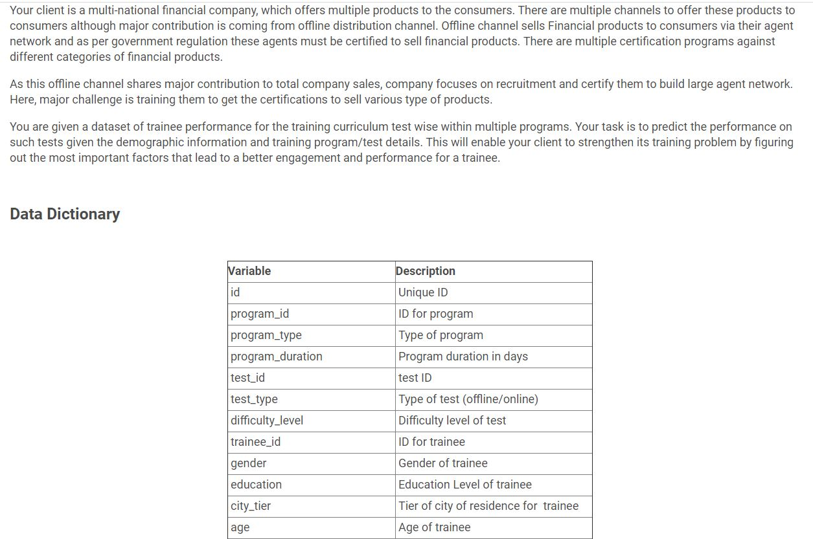

# Passorfail-MachineLearning-DecisionTree-Hackathon

## Overview
- Cleaned and preprocessed the data using NumPy, Pandas, seaborn
- Reduced the dimensionality using PCA
- Modeling and Prediction of trainee performance using Decision Tree

## Problem Statement

## Video (Click on the image)
 
 
